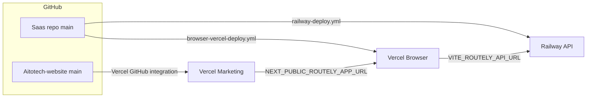

# Routely CI/CD — push to GitHub → live

End-to-end deploy flow for Routely (AitoTech): API on Railway, browser IDE on Vercel, marketing site on Vercel, desktop via GitHub Releases (later).

## Architecture

| Surface | URL | Host | Repo |
|---------|-----|------|------|
| Marketing | `https://aitotech.in/routely` | Vercel | `Aitotech-website` |
| Browser IDE | `https://app.routely.aitotech.in` | Vercel (static) | `Saas/apps/browser` |
| API | `https://api.routely.aitotech.in` | Railway (Docker) | `Saas` |
| Desktop | GitHub Releases (month 5) | — | `Saas` (Tauri stub) |



## What runs automatically

### Saas repo (`ujjwal-coder211/Saas`)

| Workflow | Trigger | Action |
|----------|---------|--------|
| `.github/workflows/railway-deploy.yml` | Push `main` (API paths) | Redeploy Railway Docker service |
| `.github/workflows/browser-vercel-deploy.yml` | Push `main` (`apps/browser/**`) | Build Vite SPA → Vercel prod |
| `.github/workflows/desktop-release.yml` | Manual | Stub until Tauri app exists |

**Alternative (recommended for API):** connect the repo in [Railway → Project → Settings → GitHub](https://railway.app). Railway deploys on every push without GitHub Actions. Keep the workflow as backup or for monorepo control.

### Aitotech-website repo

No GitHub Actions required — connect the repo in [Vercel](https://vercel.com). Push `main` → production deploy.

Set `NEXT_PUBLIC_ROUTELY_APP_URL` on Vercel so `/routely` “Try in browser” always points at the live browser app.

---

## One-time setup checklist

### 1. Railway (API)

1. Create project → **Add PostgreSQL** + **Add Redis**
2. **New Service → GitHub** → select `Saas`, branch `main`, root `/`
3. Railway reads `railway.toml` + `Dockerfile` at repo root
4. **Do not** set a custom start command in the dashboard (uses `scripts/docker-entrypoint.sh`)
5. Add custom domain: `api.routely.aitotech.in` → CNAME to Railway target
6. Set environment variables (see table below)

### 2. Vercel — browser app (separate project)

1. **Import** `Saas` repo
2. **Root Directory:** `apps/browser`
3. Framework: Vite (auto-detected; `vercel.json` included)
4. **Build env:** `VITE_ROUTELY_API_URL=https://api.routely.aitotech.in`
5. Custom domain: `app.routely.aitotech.in`
6. For GitHub Actions deploy, also add secrets (see GitHub table)

### 3. Vercel — marketing site

1. Import `Aitotech-website`
2. Set `NEXT_PUBLIC_SITE_URL=https://aitotech.in`
3. Set `NEXT_PUBLIC_ROUTELY_APP_URL=https://app.routely.aitotech.in`
4. Existing Supabase vars unchanged

### 4. DNS (aitotech.in zone)

| Record | Name | Target |
|--------|------|--------|
| CNAME | `api.routely` | Railway service hostname |
| CNAME | `app.routely` | Vercel browser project |
| (existing) | `@` / `www` | Vercel marketing project |

### 5. GitHub secrets & variables (Saas repo)

**Secrets** (Settings → Secrets and variables → Actions):

| Secret | Purpose |
|--------|---------|
| `RAILWAY_TOKEN` | Railway account token ([railway.app/account/tokens](https://railway.app/account/tokens)) |
| `RAILWAY_SERVICE_ID` | Optional if using `railway up`; required for `railway redeploy --service` |
| `VERCEL_TOKEN` | Vercel token for browser deploy action |
| `VERCEL_ORG_ID` | Vercel team/user ID |
| `VERCEL_BROWSER_PROJECT_ID` | Vercel project ID for `apps/browser` |

**Variables** (optional overrides):

| Variable | Default | Purpose |
|----------|---------|---------|
| `VITE_ROUTELY_API_URL` | `https://api.routely.aitotech.in` | Browser build API base |
| `RAILWAY_SERVICE_ID` | — | Same as secret; can live in Variables |

Find Vercel IDs: `vercel link` in `apps/browser`, then read `.vercel/project.json`.

---

## Environment variables

### Railway (API service)

Copy from `.env.production.example`. Minimum for Routely beta:

```env
NEURALROUTER_APP_NAME=Routely API
NEURALROUTER_APP_VERSION=0.1.0-routely
DATABASE_URL=<from Railway Postgres plugin>
REDIS_URL=<from Railway Redis plugin>
OPENROUTER_API_KEY=<your key>
DEEPINFRA_API_KEY=<optional fallback>
SAAS_PUBLIC_URL=https://api.routely.aitotech.in
NEURALROUTER_CORS_ORIGINS=https://app.routely.aitotech.in,https://aitotech.in
PUBLIC_DEMO_ENABLED=true
PUBLIC_DEMO_RATE_LIMIT=20
NEURALROUTER_RATE_LIMIT=60
```

Add when ready: `CLERK_*`, `STRIPE_*`, `SARVA_VAULT_*`, `AKSH_SEARCH_*`.

### Vercel — browser project (`apps/browser`)

| Variable | Value |
|----------|-------|
| `VITE_ROUTELY_API_URL` | `https://api.routely.aitotech.in` |

### Vercel — marketing site (`Aitotech-website`)

| Variable | Value |
|----------|-------|
| `NEXT_PUBLIC_SITE_URL` | `https://aitotech.in` |
| `NEXT_PUBLIC_ROUTELY_APP_URL` | `https://app.routely.aitotech.in` |
| `NEXT_PUBLIC_SUPABASE_URL` | (existing) |
| `NEXT_PUBLIC_SUPABASE_ANON_KEY` | (existing) |
| `SUPABASE_SERVICE_ROLE_KEY` | (existing) |

Optional live demo on `/routely/demo`:

```env
AKSH_DEMO_LIVE=true
AKSH_API_URL=https://api.routely.aitotech.in
AKSH_API_KEY=<agents key if required>
```

---

## Browser deploy options

### Option A — Vercel static (default)

- Workflow: `browser-vercel-deploy.yml`
- Domain: `app.routely.aitotech.in`
- API calls cross-origin to `api.routely.aitotech.in` (CORS configured)

### Option B — Embed in FastAPI `/web/browser/`

Same Railway service as API — no second host:

```bash
cd Saas
VITE_ROUTELY_API_URL= npm run --prefix apps/browser build   # same-origin
# or
./scripts/build-browser-static.sh
git add web/browser && git commit && git push
```

Serve at `https://api.routely.aitotech.in/web/browser/` (or point `app.routely` CNAME at Railway and add a redirect rule).

---

## Desktop releases (month 5 — manual for now)

1. Workflow `.github/workflows/desktop-release.yml` is a **stub**
2. When `apps/desktop` (Tauri) exists:
   - Build Windows/macOS/Linux artifacts
   - `gh release create v0.1.0 --notes "Routely desktop" dist/*`
   - Add download link on `aitotech.in/routely` pointing to latest release asset

---

## Post-deploy verification

```bash
# API
curl -s https://api.routely.aitotech.in/health | jq .

# Browser (should return HTML)
curl -sI https://app.routely.aitotech.in | head -1

# Marketing link (build-time env)
# Open https://aitotech.in/routely → "Try in browser" → app.routely.aitotech.in
```

From repo:

```powershell
python scripts/verify_setup.py
```

---

## Still manual

| Task | Why |
|------|-----|
| Railway GitHub connect **or** `RAILWAY_TOKEN` | One-time platform auth |
| Vercel project creation + domains | DNS + hosting setup |
| Provider API keys on Railway | Secrets not in git |
| Clerk / Stripe | Phase 2 billing |
| Tauri desktop build | Not implemented yet (month 5) |
| `AKSH_DEMO_LIVE` on marketing Vercel | Optional; mock demo is default (free) |

---

## Related docs

- [DEPLOY.md](./DEPLOY.md) — generic Railway/Render scaffold
- [ROUTELY.md](./ROUTELY.md) — product architecture
- `Aitotech-website/.env.example` — marketing env template
